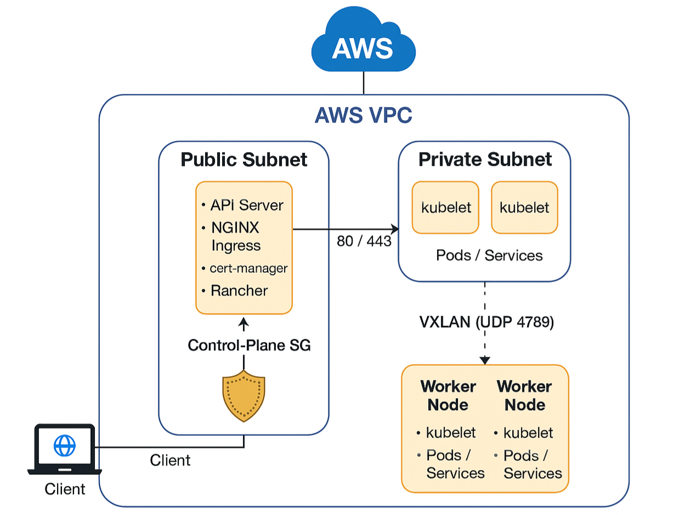

# 📘 **Kubernetes + Rancher Cluster Architecture (AWS Deployment)**

### **EC2 Instances: Control‑Plane (Public Subnet) + 3 Worker Nodes (Private Subnets)**

### **Calico VXLAN • NGINX Ingress • cert‑manager • Rancher**

This document describes the reference architecture used to deploy a secure, production‑ready **Kubernetes cluster with Rancher** on AWS. The cluster is built using **one control-plane node in a public subnet** and **three worker nodes in private subnets**, connected through **Calico VXLAN overlay networking**.

The control-plane exposes only the required interfaces while worker nodes remain fully private for enhanced security. Rancher is deployed behind an **NGINX ingress controller**, using **Let’s Encrypt** for automatic TLS certificates.

***

##  Architecture — k8s-rancher (1 Control, 3 Workers on AWS)

### High-Level Overview

*   **Cloud**: AWS VPC (single region)
*   **Subnets**:
    *   **Public Subnet**: 1 × Control-Plane node (Ubuntu 24.04) with public IP
    *   **Private Subnets**: 3 × Worker nodes (Ubuntu 24.04) **no public IP**
*   **Networking**:
    *   **CNI**: Calico with **VXLAN-only** dataplane (IPIP disabled, BGP mesh disabled)
    *   **Overlay Port**: UDP **4789** (VXLAN)
    *   **NodePort Range**: TCP/UDP **30000–32767** (exposed on worker SG if needed)
*   **Ingress**:
    *   **NGINX Ingress Controller** pinned to the **control-plane** (hostNetwork + hostPorts)
    *   External traffic ⟶ Control-Plane (80/443) ⟶ NGINX ⟶ Services/Pods (overlay)
*   **Certificates**:
    *   **cert-manager** (Let’s Encrypt - HTTP-01 via NGINX)
*   **Platform**:
    *   **Rancher** installed in `cattle-system`, served via NGINX Ingress
    *   **DNS**: `rancher.shreyash.cloud` → Control-plane public IP

***

## Diagram (Logical)



***

## Traffic Flow

1.  **User → DNS**: `rancher.shreyash.cloud` resolves to the **control-plane’s public IP**.
2.  **User → NGINX**: Traffic hits ports **80/443** on the control-plane (hostNetwork = true).
3.  **Ingress → Services**: NGINX routes traffic to services/endpoints across nodes over **Calico VXLAN (UDP 4789)**.
4.  **Kubernetes Control Traffic**:
    *   Workers → API Server (control-plane **6443**)
    *   etcd local to control-plane (**2379–2380**)
    *   kubelet on each node (**10250**)

***

## Security Groups (aligned with your script)

**Control-Plane SG**

*   **Ingress (public)**:
    *   TCP **6443** (K8s API)
    *   TCP **22** (SSH) – restrict to your IP/CIDR
    *   TCP **80/443** (HTTP/HTTPS to NGINX)
*   **Ingress (from Worker SG)**:
    *   TCP **6443**, **9345** (cluster comms)
    *   UDP **4789** (VXLAN)
*   **Self**:
    *   TCP **2379–2380** (etcd), **10250** (kubelet), UDP **4789**
*   **Egress**: allow all

**Worker SG**

*   **Ingress (public)**:
    *   TCP/UDP **30000–32767** (NodePorts) *\[optional if you only use ingress]*
    *   TCP **22** (SSH) – restrict to your IP/CIDR
*   **Ingress (from Control-Plane SG)**:
    *   TCP **10250**, **9345**; UDP **4789**
*   **Self**:
    *   TCP **10250**, UDP **4789**, UDP **8472** *(if flannel were used; harmless to leave)*
*   **Egress**: allow all

***

## Subnet & Routing

*   **Public Subnet**:
    *   Route to **Internet Gateway**
    *   Control-plane has **public IP**
*   **Private Subnets**:
    *   Route to **NAT Gateway** for egress (packages/registries)
    *   No public IPs on workers

***

## Node Roles & Labels

*   **Control-Plane**:
    *   Taint/Tolerations default for control-plane
    *   Label for ingress: `ingress-ready=true` (so NGINX can be scheduled here)
*   **Workers**:
    *   No public IPs, run application workloads and Rancher-managed agents

***

## DNS & Certificates

*   DNS A-record:  
    `rancher.shreyash.cloud → <Control-Plane Public IP>`
*   cert-manager (Let’s Encrypt, HTTP-01) uses **NGINX** ingress class to complete challenges on the control-plane.

***

## Inventory (example)

```ini
# inventory/hosts.ini
[control]
cp-1 ansible_host=<CONTROL_PUBLIC_IP> ansible_user=ubuntu

[workers]
wk-1 ansible_host=<WK1_PRIVATE_IP> ansible_user=ubuntu
wk-2 ansible_host=<WK2_PRIVATE_IP> ansible_user=ubuntu
wk-3 ansible_host=<WK3_PRIVATE_IP> ansible_user=ubuntu

[k8s:children]
control
workers
```

> Ensure private instances are reachable from the Ansible runner via private IP (e.g., through the control-plane as bastion/ProxyCommand, or via VPN/SSM).

***

## Why VXLAN-Only?

*   Works reliably across **mixed subnet types** (public control-plane + private workers)
*   **No BGP** dependency or route propagation in AWS
*   Encapsulates pod traffic cleanly over **UDP 4789**

***


## **Part 1 — Preparing Nodes for K8S**


### **Phase 0 — Initial Setup (SSH Key, Ansible, Calico Networking)**

Environment: **1 Control‑Plane + 3 Worker Nodes**, Ubuntu 24.04  
Infrastructure: **AWS EC2 (Control plane in Public Subnet, Workers in Private Subnet)**

***

## **Step 1 — Prepare SSH Private Key**

Ensure your Kubernetes cluster private key is stored at:

    ~/.ssh/k8s.pem

Fix its permissions (required by SSH/Ansible):

```bash
chmod 400 ~/.ssh/k8s.pem
```

***

## **Step 2 — Verify Ansible Connectivity**

Check whether Ansible can successfully reach all nodes:

```bash
ansible -i inventory/hosts.ini all -m ping \
  -u ubuntu \
  --private-key ~/.ssh/k8s.pem
```

Expected output:

    node01 | SUCCESS => {"changed": false, "ping": "pong"}
    node02 | SUCCESS => {"changed": false, "ping": "pong"}
    ...

If every node responds with `"pong"`, proceed.

***

## **Step 3 — Run the Main Ansible Playbook**

This installs container runtime, kubeadm, prepares nodes, etc.

```bash
ansible-playbook -i inventory/hosts.ini site.yml \
  -u ubuntu \
  --private-key ~/.ssh/k8s.pem \
  -b
```

***

# **Step 4 — Configure Calico (VXLAN‑Only Dataplane)**

After the cluster is up and running, modify Calico to:

*   Disable IPIP
*   Enable VXLAN
*   Disable BGP

This is the recommended setup for **mixed subnets (public + private)** on AWS.

***

### **4.1 Disable IPIP + Enable VXLAN**

```bash
kubectl patch ippool default-ipv4-ippool --type=merge -p '{
  "spec": {
    "ipipMode": "Never",
    "vxlanMode": "Always"
  }
}'
```

***

### **4.2 Disable BGP Node‑to‑Node Mesh**

```bash
kubectl apply -f - <<'EOF'
apiVersion: crd.projectcalico.org/v1
kind: BGPConfiguration
metadata:
  name: default
spec:
  nodeToNodeMeshEnabled: false
EOF
```

***

### **4.3 Restart Calico**

```bash
kubectl -n kube-system rollout restart ds/calico-node
```

***

### **4.4 Verify Calico Nodes**

```bash
kubectl -n kube-system get pods -l k8s-app=calico-node
```

Expected:

    calico-node-xxxxx   1/1   Running   0   10s
    calico-node-yyyyy   1/1   Running   0   10s
    ...

***


## **Part 2: HELM + Rancher Installation**

### **Prerequisites Check**
```bash
# Check cluster status
kubectl get nodes
kubectl cluster-info
```

### **PHASE 1: PREPARATION**

**Step 1.1: Label Control-Plane Node**
```bash
kubectl label node ip-10-0-6-214 ingress-ready=true
```

**Step 1.2: Add Helm Repositories**
```bash
helm repo add jetstack https://charts.jetstack.io
helm repo add ingress-nginx https://kubernetes.github.io/ingress-nginx
helm repo add rancher-latest https://releases.rancher.com/server-charts/latest
helm repo update
```

### **PHASE 2: CERT-MANAGER INSTALLATION**

**Step 2.1: Install cert-manager**
```bash
kubectl create namespace cert-manager
helm install cert-manager jetstack/cert-manager \
  --namespace cert-manager \
  --create-namespace \
  --version v1.14.5 \
  --set installCRDs=true
```

**Step 2.2: Wait for cert-manager**
```bash
sleep 30
kubectl -n cert-manager wait --for=condition=Ready pods --all --timeout=300s
kubectl -n cert-manager get pods
```

### **PHASE 3: NGINX INGRESS INSTALLATION**

**Step 3.1: Create NGINX values file**
```bash
cat <<EOF > nginx-values.yaml
controller:
  hostNetwork: true
  kind: Deployment
  service:
    type: ClusterIP
    enabled: false
  hostPort:
    enabled: true
  nodeSelector:
    ingress-ready: "true"
  tolerations:
  - key: "node-role.kubernetes.io/control-plane"
    effect: "NoSchedule"
    operator: "Exists"
EOF
```

**Step 3.2: Install NGINX**
```bash
kubectl create namespace ingress-nginx
helm install ingress-nginx ingress-nginx/ingress-nginx \
  --namespace ingress-nginx \
  --create-namespace \
  -f nginx-values.yaml
```

**Step 3.3: Verify NGINX**
```bash
kubectl -n ingress-nginx get pods -o wide
kubectl -n ingress-nginx get deployment
```

### **PHASE 4: NETWORK CONFIGURATION**

**Step 4.1: Fix rp_filter on Control-Plane**
```bash
# Check current value
cat /proc/sys/net/ipv4/conf/all/rp_filter

# Fix it
sudo sysctl -w net.ipv4.conf.all.rp_filter=2
echo "net.ipv4.conf.all.rp_filter=2" | sudo tee -a /etc/sysctl.conf
sudo sysctl -p

# Verify
cat /proc/sys/net/ipv4/conf/all/rp_filter
```

### **PHASE 5: COREDNS CONFIGURATION**

**Step 5.1: Get Control-Plane IP**
```bash
CONTROL_PLANE_IP=$(kubectl get node ip-10-0-6-214 -o jsonpath='{.status.addresses[0].address}')
echo "Control Plane IP: $CONTROL_PLANE_IP"
```

**Step 5.2: Update CoreDNS**
```bash
# Backup current config
kubectl -n kube-system get configmap coredns -o yaml > coredns-backup.yaml

# Update CoreDNS with the host entry
kubectl -n kube-system get configmap coredns -o yaml | \
  sed "/forward \. \/etc\/resolv.conf {/i\        hosts {\n          $CONTROL_PLANE_IP rancher.shreyash.cloud\n          fallthrough\n        }" | \
  kubectl apply -f -

# Restart CoreDNS
kubectl -n kube-system rollout restart deployment coredns
kubectl -n kube-system wait --for=condition=Ready pod -l k8s-app=kube-dns --timeout=120s
```

### **PHASE 6: RANCHER INSTALLATION**

**Step 6.1: Install Rancher with CORRECT ingress class**
```bash
kubectl create namespace cattle-system
helm install rancher rancher-latest/rancher \
  --namespace cattle-system \
  --create-namespace \
  --set hostname=rancher.shreyash.cloud \
  --set bootstrapPassword=admin \
  --set replicas=1 \
  --set ingress.ingressClassName=nginx \
  --set ingress.tls.source=rancher
```

**Step 6.2: Wait for Rancher**
```bash
sleep 30
kubectl -n cattle-system wait --for=condition=Ready pods -l app=rancher --timeout=300s
kubectl -n cattle-system get pods
```

### **PHASE 7: LET'S ENCRYPT CERTIFICATE SETUP**

**Step 7.1: Create ClusterIssuer (REPLACE EMAIL!)**
```bash
# Replace admin@shreyash.cloud with YOUR email
cat <<EOF | kubectl apply -f -
apiVersion: cert-manager.io/v1
kind: ClusterIssuer
metadata:
  name: letsencrypt-prod
spec:
  acme:
    server: https://acme-v02.api.letsencrypt.org/directory
    email: admin@shreyash.cloud  # ⚠️ CHANGE THIS TO YOUR REAL EMAIL!
    privateKeySecretRef:
      name: letsencrypt-prod
    solvers:
    - http01:
        ingress:
          class: nginx
EOF
```

**Step 7.2: Create Certificate**
```bash
cat <<EOF | kubectl apply -f -
apiVersion: cert-manager.io/v1
kind: Certificate
metadata:
  name: rancher-tls
  namespace: cattle-system
spec:
  secretName: rancher-tls
  issuerRef:
    name: letsencrypt-prod
    kind: ClusterIssuer
  commonName: rancher.shreyash.cloud
  dnsNames:
  - rancher.shreyash.cloud
EOF
```

**Step 7.3: Monitor Certificate**
```bash
# Watch certificate status
kubectl -n cattle-system get certificate -w

# In another terminal, watch challenges
kubectl -n cattle-system get challenge -w
```

### **PHASE 8: NGINX CERTIFICATE CONFIGURATION**

**Step 8.1: Configure NGINX to use Let's Encrypt certificate**
```bash
kubectl -n ingress-nginx patch configmap ingress-nginx-controller --type=merge \
  -p '{"data":{"default-ssl-certificate":"cattle-system/rancher-tls"}}'
```

**Step 8.2: Restart NGINX**
```bash
kubectl -n ingress-nginx rollout restart deployment ingress-nginx-controller
kubectl -n ingress-nginx wait --for=condition=Ready pods --all --timeout=180s
```
